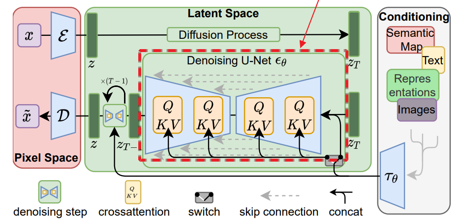

## A simple implementation of the UNet of SD v1.5.

It can directly load the SD model config and weights in the `diffusers`.

```python
from diffusers import StableDiffusionPipeline
from simple_sd_unet.unet import Cond_UNet2DModel

pipe = StableDiffusionPipeline.from_pretrained("runwayml/stable-diffusion-v1-5")
unet = Cond_UNet2DModel(pipe.unet.config)
unet.load_state_dict(pipe.unet.state_dict())
```

